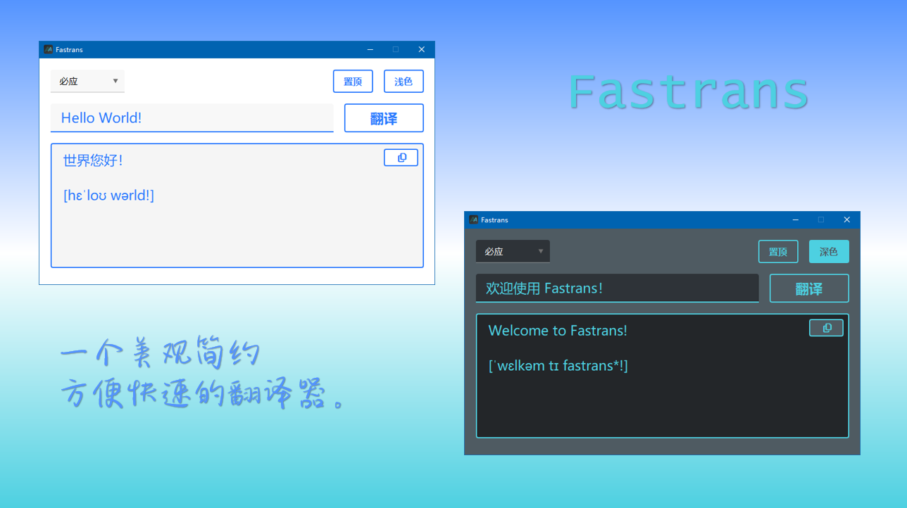

# Fastrans

 

  
Fastrans 是一个美观简约、方便快速的翻译软件，支持多种语言。
 
Fastrans is a pretty and fast translation software, which supports most languages.
  

## 🔍 预览 / Preview

## ✨ 功能 / Features

- 英汉互译 / English-Chinese translation
- 其他语种自动翻译中文 / Automatically translate other languages to Chinese
- 明暗主题切换 / Switch between light and dark mode
- 可选不同翻译平台（支持必应、有道、搜狗）/ Optional different translation platforms (support Bing, Youdao, Sogou)
- 可显示音标 / Available to show phonetic symbol
- 可置顶窗口 / Available to pin the window

## ✒ 技术 / Technology

- Python 3.12
- 使用 translators 库获取不同平台翻译结果 / Use translators to get results from different platforms
- 使用 PyQt5 构建 GUI / Use PyQt5 to build GUI
- 使用 qt-material 主题美化界面 / Use qt-material to beautify the GUI
- 使用 eng_to_ipa 显示音标 / Use eng_to_ipa to show phonetic symbol

## 🎯 待办 / Todo

**欢迎 PR！**

- 翻译历史记录 / Translation history
- 最小化托盘 / Minimize to tray
- 快捷键弹出窗口 / Pop up window with shortcut keys