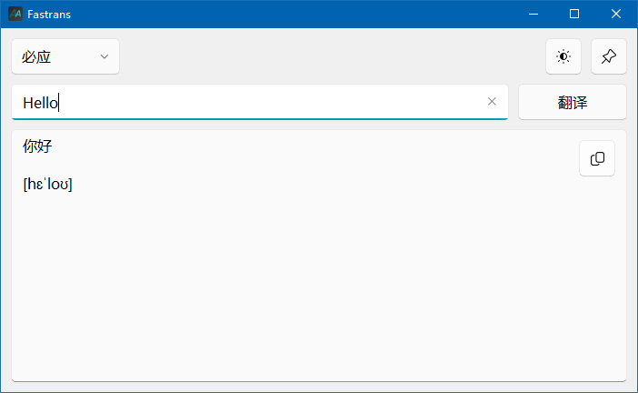

# Fastrans

 

  
Fastrans 是一个美观简约、方便快速的翻译软件，支持多平台。
  

## 🔍 预览 / Preview

## ✨ 功能 / Features

- [x] 英汉互译
- [x] 明暗主题切换
- [x] 可选不同翻译平台（支持必应、有道、搜狗）
- [x] 可显示音标
- [x] 可置顶窗口
- [x] 最小化托盘
- [x] 快捷键弹出窗口

> [!TIP]
> 目前核心功能已完成，更多功能敬请期待！

## ✒ 技术

- Python 3.12
- 使用 translators 库获取不同平台翻译结果
- 使用 PyQt5 构建 GUI
- 使用 pyqt-fluent-widgets 主题美化界面
- 使用 eng_to_ipa 显示音标
- 使用 keyboard 绑定快捷键

## 🎯 待办 / Todo

**欢迎 PR！**

- [ ] 翻译历史记录
- [ ] 设置页面